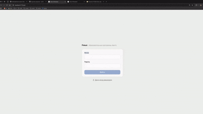
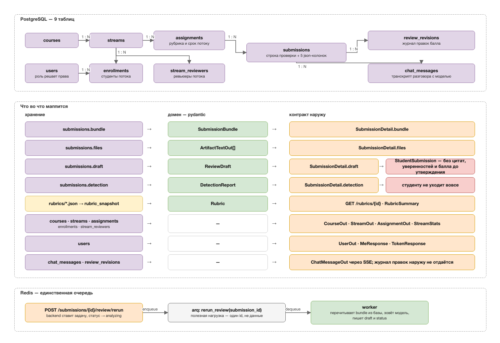

# Avito AI Reviewer


Рабочее место ревьюера образовательных программ Авито. На вход — pull request
студента, на выход — черновик разбора по рубрике курса: балл по каждому
критерию с цитатой из кода, формальные проверки условия и рекомендательный
сигнал о следах ИИ. Ревьюер правит и утверждает; итоговое решение за ним.

<p align="center">
  
</p>

## Запуск

```bash
docker compose up --build
```

Поднимает `postgres`, `redis`, `backend`, `worker`, `frontend`.

- UI — http://localhost:5173
- API — http://localhost:8000, Swagger — http://localhost:8000/docs

Без ключей работает провайдер `fake`: конвейер проходится целиком, вердикты
приезжают пустыми. С ключом модели:

```bash
AI_LLM__PROVIDER=external AI_LLM__API_KEY="$ключ" \
INGEST_GITHUB__TOKEN="$(gh auth token)" docker compose up -d backend worker
```

`INGEST_GITHUB__TOKEN` нужен только для приватных репозиториев.

Все ручки, кроме `/health`, `/init` и `/auth/login`, требуют вход. UI
открывается экраном входа; сеяные аккаунты — `student`, `reviewer`,
`methodist`, `admin`, пароль `avito2026`. Кнопка «Демо-вход ревьюером» пускает
без пароля — для записи демо; `AUTH_DEMO_LOGIN=false` её убирает. Под каждую карточку из
`backend/reviewers/` заводится аккаунт с логином по имени файла.

```bash
curl -X POST http://localhost:8000/auth/login \
  -H "Content-Type: application/json" \
  -d '{"username": "reviewer", "password": "avito2026"}'
```

На чистой базе нет ни курсов, ни потоков, ни заданий: на старте заводятся
только аккаунты. Экран «Проверить работу» это видит и просит назвать рубрику и
срок руками — то есть выглядит как до появления заданий. Заведите демо-курс:

```bash
docker compose exec backend uv run python scripts/seed_demo_submission.py
```

Скрипт идемпотентен и создаёт курс, поток, задание, зачисление и одну
утверждённую сдачу. После него в «Проверить работу» появляется выбор задания
(курс, поток, рубрика и срок — из настроек методиста), а поля рубрики и
дедлайна уходят.

### Без Docker

```bash
cd backend && uv sync && uv run uvicorn avito_reviewer.app.main:app --reload   # :8000
cd frontend && npm install && npm run dev                                     # :5173
```

Без Postgres и Redis: `DB_DSN=sqlite+aiosqlite:///./dev.db` в `backend/.env`;
Redis нужен только для `POST /submissions/{id}/review/rerun`.

## Как устроено


- `backend` и `worker` — один образ с разными entrypoint; общего состояния нет,
  связь через Redis только на `review/rerun`.
- `POST /review` синхронен: ingest → gate → review → detection в одном
  обработчике, блокирующие вызовы через `run_in_threadpool`.
- Четыре шага работают над одним `SubmissionBundle`: `gate` — без обращений к
  модели, `review` — запрос на критерий с обязательной цитатой, `detection` —
  ансамбль сигналов (форензика 0.35, judge 0.25, стилометрия 0.15; перплексия
  объявлена, но не подключена), `chat` — поверх сохранённого черновика.
- `PrivacyGateway` — единственный сетевой выход: скраб ПДн, роутинг задачи на
  провайдера, аудит вызовов и стоимости.
- Балл собирает агрегатор, не модель: цитаты сверяются с текстом артефакта,
  затем веса критериев → шаг шкалы → штраф за просрочку → минимумы и порог.

Диаграмма отражает код как он есть; целевая форма — в `docs/architecture.md`.

## Модель данных



- Реляционная часть — 9 таблиц; `enrollments` и `stream_reviewers` разрешают
  M:N между `users` и `streams`.
- Всё, что посчитал конвейер, лежит в пяти json-колонках `submissions` и уезжает
  наружу теми же pydantic-моделями: `bundle → SubmissionBundle →
  SubmissionDetail.bundle`, и так по каждой колонке.
- Один `draft` даёт два контракта: полный `SubmissionDetail.draft` ревьюеру и
  урезанный `StudentSubmission` студенту. `detection` студенту не уходит вовсе.
- Каталог рубрик лежит файлами вне базы; `rubric_snapshot` — копия на момент
  разбора, поэтому правка файла не меняет уже выставленные оценки.
- В задачу Redis кладётся `submission_id`, а не данные: worker перечитывает
  `bundle` из базы и пишет обратно `draft` и `status`.

Исходники диаграмм — [docs/datamodel.drawio](docs/datamodel.drawio) и
[docs/pipeline.drawio](docs/pipeline.drawio), открываются в
[app.diagrams.net](https://app.diagrams.net).

## Где что лежит

```
backend/src/avito_reviewer/
  app/        HTTP-слой: роутеры, схемы, JWT и RBAC
  ingest/     ссылка → SubmissionBundle (провайдер GitHub)
  ai/         gate, review, detection, chat, compiler, llm/ (PrivacyGateway)
  db/         SQLAlchemy 2 async, модели и миграции
  distribution/ раскладка работ по ревьюерам
backend/rubrics/    рубрики как данные: добавить курс = добавить JSON
backend/reviewers/  карточки ревьюеров
frontend/src/
  app/        оболочка, маршруты, сессия
  features/   экраны: auth, review, rubrics, teaching, student, courses, admin
  lib/        клиент бэкенда, адаптеры, типы
  mocks/      каталог программ и записанные прогоны
```

## Дальше

- [CLAUDE.md](CLAUDE.md) — правила работы и обязательные проверки перед коммитом.
- [docs/](docs/README.md) — состояние бэкенда и фронтенда, архитектура, демо-данные,
  сценарии ручной проверки, список задач.
