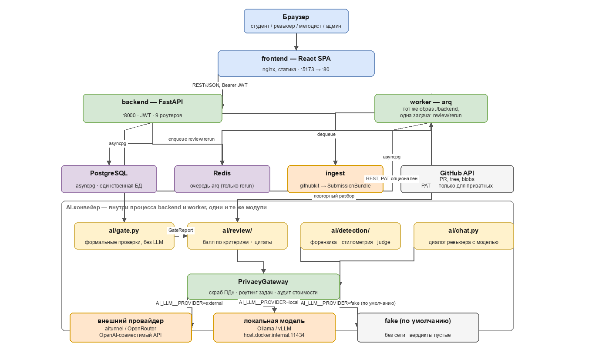

# Avito AI Reviewer


Рабочее место ревьюера образовательных программ Авито. На вход — pull request
студента, на выход — черновик разбора по рубрике курса: балл по каждому
критерию с цитатой из кода, формальные проверки условия и рекомендательный
сигнал о следах ИИ. Ревьюер правит и утверждает; итоговое решение за ним.

## Запуск

```bash
docker compose up --build
```

Поднимает `postgres`, `redis`, `backend`, `worker`, `frontend`.

- UI — http://localhost:5173
- API — http://localhost:8000, Swagger — http://localhost:8000/docs

Без ключей работает провайдер `fake`: конвейер проходится целиком, вердикты
приезжают пустыми. С ключом модели:

```bash
AI_LLM__PROVIDER=external AI_LLM__API_KEY="$ключ" \
INGEST_GITHUB__TOKEN="$(gh auth token)" docker compose up -d backend worker
```

`INGEST_GITHUB__TOKEN` нужен только для приватных репозиториев.

Все ручки, кроме `/health`, `/init` и `/auth/login`, требуют вход. Фронтенд
логинится сам; для ручных запросов — сеяные аккаунты `student`, `reviewer`,
`methodist`, `admin` с паролем `avito2026`. Под каждую карточку из
`backend/reviewers/` заводится аккаунт с логином по имени файла.

```bash
curl -X POST http://localhost:8000/auth/login \
  -H "Content-Type: application/json" \
  -d '{"username": "reviewer", "password": "avito2026"}'
```

### Без Docker

```bash
cd backend && uv sync && uv run uvicorn avito_reviewer.app.main:app --reload   # :8000
cd frontend && npm install && npm run dev                                     # :5173
```

Без Postgres и Redis: `DB_DSN=sqlite+aiosqlite:///./dev.db` в `backend/.env`;
Redis нужен только для `POST /submissions/{id}/review/rerun`.

## Как устроено



Исходник — [docs/pipeline.drawio](docs/pipeline.drawio), открывается в
[app.diagrams.net](https://app.diagrams.net). Диаграмма отражает код как он
есть; целевая форма — в `docs/architecture.md`.

- **backend** и **worker** — один образ (`./backend`), разный entrypoint. Между
  собой связаны только через Redis и только для
  `POST /submissions/{id}/review/rerun`; остальной путь запроса синхронный.
- **ingest** превращает ссылку на pull request в `SubmissionBundle` — дерево
  файлов, диффы, история коммитов — через `githubkit`.
- Разбор идёт в четыре шага: `gate` (формальные проверки рубрики, без токенов)
  → `review` (модель отвечает по одному критерию с цитатой, сумму считает код)
  → `detection` (форензика истории, стилометрия, модель-судья; отчёт
  рекомендательный) → `chat` (переспросить модель про черновик).
- Всё, что идёт в модель, проходит через `PrivacyGateway` — единственную точку
  выхода наружу: обезличивание до отправки, восстановление только внутри
  периметра. Маршрут задаёт `AI_LLM__PROVIDER`: `external` (OpenAI-совместимый
  API), `local` (Ollama/vLLM) или `fake` по умолчанию.

## Где что лежит

```
backend/src/avito_reviewer/
  app/        HTTP-слой: роутеры, схемы, JWT и RBAC
  ingest/     ссылка → SubmissionBundle (провайдер GitHub)
  ai/         gate, review, detection, chat, compiler, llm/ (PrivacyGateway)
  db/         SQLAlchemy 2 async, модели и миграции
  distribution/ раскладка работ по ревьюерам
backend/rubrics/    рубрики как данные: добавить курс = добавить JSON
backend/reviewers/  карточки ревьюеров
frontend/src/
  app/        оболочка, маршруты, сессия
  features/   экраны: review, rubrics, teaching, student, courses
  lib/        клиент бэкенда, адаптеры, типы
  mocks/      каталог программ и записанные прогоны
```

## Дальше

- [CLAUDE.md](CLAUDE.md) — правила работы и обязательные проверки перед коммитом.
- [docs/](docs/README.md) — состояние бэкенда и фронтенда, архитектура, демо-данные,
  сценарии ручной проверки, список задач.
