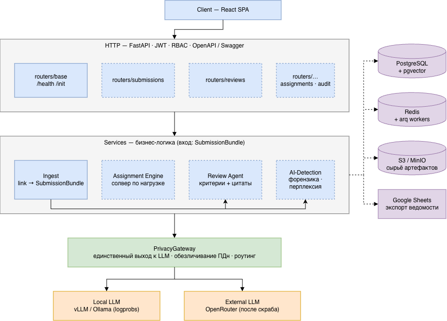

# Документация

Вся документация проекта живёт здесь, в корневом `docs/`. Код и `README.md` на
это не ссылаются в обход — если что-то стоит записать, запись идёт сюда.

| Документ | О чём |
|---|---|
| **[../CLAUDE.md](../CLAUDE.md)** | Как здесь работать: запуск, обязательные проверки, правила, оплаченные ошибками, и решения, которые не надо пересматривать наугад. Для того, кто берёт проект дальше, и для его агентов |
| **[architecture.md](architecture.md)** | Архитектура решения целиком: питч, диаграммы, обоснование стека, план на хакатон. Design-документ — описывает целевую форму системы, не всегда совпадает с тем, что уже в коде (см. handover-* за фактическим статусом) |
| **[backend.md](backend.md)** | Бэкенд: запуск, конфигурация, эндпоинты, структура пакетов, как расширять |
| **[frontend.md](frontend.md)** | Фронтенд: запуск, docker, где что лежит |
| **[handover-backend.md](handover-backend.md)** | Состояние бэкенда: что реально работает, грабли, на которые уже наступали, чего нет |
| **[handover-frontend.md](handover-frontend.md)** | Состояние фронтенда: граница живого API и синтетики, правила, которые диктует бэкенд, список несделанного |
| **[services.md](services.md)** | AI-слой изнутри: ревью-агент и детектор ГенИИ, их контракты и состояние |
| **[demo-data.md](demo-data.md)** | Что лежит для показа: учебные PR, показательная сдача, записанные прогоны, каталог программ. Откуда взято, что настоящее и чему верить не стоит |
| **[happy-path.md](happy-path.md)** | Сценарии для ручной проверки в браузере, сгруппированные по фичам — что наклацать, чтобы убедиться самому |

Начинайте с `handover-*` — это единственные документы, которые обещают
отражать код как он есть сейчас, а не как задумано.

